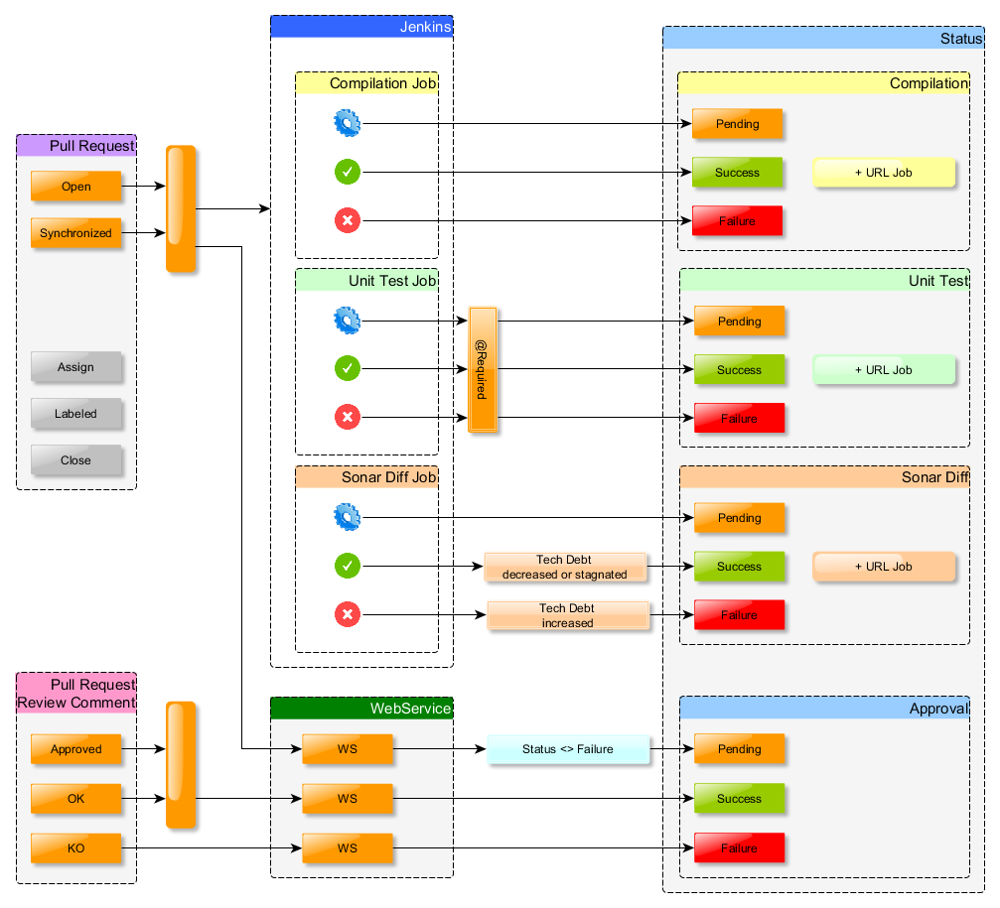

# PullRequest approval

PullRequest approval is used as a github webhook in order to manage the manual approvement from pull request comments.
The webservice can be called by each github's event. But currently, it only reacts on "Issue Comment" and "Pull Request" events. 

## Issue Comment

When a user types "approved" or "ok" (configurable), the webservice posts a SUCCESS status
When a user types "rejected", "ko" or "refused" (configurable), the webservice posts a FAILURE status 
When a user types "to be reviewed" (configurable), the webservice resets the status to PENDING

The usable words are configured in application.properties
* issue.comments.approval.list=approved,ok
* issue.comments.rejection.list=refused,ko,rejected
* issue.comments.pending.list=to be reviewed

### auto-approvement

Normally, the user who creates the pull request shouldn't be able to approve himself the same pull request. 
The webservice is configured to retrieve ".pullrequest-approval/configuration.properties" from remote repository.

Regarding to the value of "auto_approval.authorized" key, the auto-approvement will be authorized or not.
By default, and if the remote configuration file does not exist, the auto-approvement is not authorized.

## Pull Request

When a pull request is opened, the webservice resets the status to PENDING
When a pull request is synchronized (new commit), the webservice resets also the status to PENDING
* Indeed, when a new commit is pushed, the pull request has to be reviewed again.

## Configuration

In order to use the webhook, repository has to following several directives.

###1 Configuration.properties

The repostory should provide "configuration.properties" stored in ".pullrequest-approval" folder.

The file configuration.properties provides local properties. Currently, only one is defined
* auto_approval.authorized=true

###2. Declare branch as protected (settings/branches)

To enable status checking, a branch has to be declared as protected and "require status check to pass before merging" has to be chosen. 
Once the first status will be updated, it will be possible to tick the list of status to check. 

###3. Declare a confident user with write rights (settings/collaborators)

**This solution is bad and must be enhanced in further version** 

Currently, the user which post status is define in webservice's application.properties file
* handler.authorization.login=*****
* handler.authorization.password=*****

The same user has to be added in repository collaborators with write rights. 

###4. Declare the webhook (settings/webhooks & services)

This current webservice has to be used as webhooks. 
* Payload URL : URL/webhook
* Which events would you like to trigger this webhook? 
** Let me select individual events
*** Pull request
*** Issue comment

## Software Factory Principle

Let's have a look to the following scheme. The current webservice is the box which is the most down.

